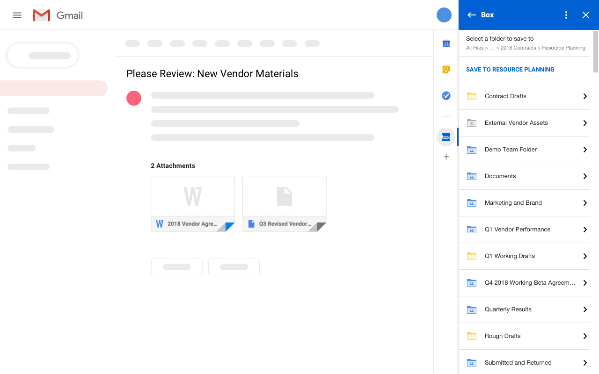

## 3rd-Party Plugin Platform Evaluation

- [GMail Add-Ons](#/gmail)
- [Outlook Add-Ins](#/outlook)
- [Slack Apps](#/slack)


<!-- .slide: id="gmail" -->
## Gmail Add-Ons

- Sidebar
- Compose
- Apps Script
- Cards


## Gmail Add-On example: Box

<div class="r-stack r-stretch">
  
  
  
</div>


## Gmail Add-On example

Sidebar


## Gmail Add-On example

Compose Modal


## Gmail Add-On example

Compose Insert


<!-- .slide: id="outlook" -->
## Outlook Add-Ins

- one
- two
- three


<!-- .slide: id="slack" -->
## Slack Apps

- one
- two
- three


<!-- .slide: data-background="blue" -->
## Intro

- one <!-- .element: class="fragment" data-fragment-index="2" -->
- two <!-- .element: class="fragment" data-fragment-index="3" -->
- three <!-- .element: class="fragment" data-fragment-index="4" -->
- [link to priorities](#/priorities)


# Code

```js [1-2|3|4]
let a = 1;
let b = 2;
let c = x => 1 + 2 + x;
c(3);
```


<!-- .slide: id="priorities" -->
## Priorities
1. Plugin framework /shim
2. Broker
3. Developer dashboard
4. Eventing webhooks
5. APIs

[&larr; Back to beginning](#/0)


## Technologies

<div class="text80">

API | Description 
--- | ---
**Front-end Plugin** | UI components displayed in the Zipwhip app
**Back-end APIs** | External server sends requests to Zipwhip API
**Webhooks** | Zipwhip sends notifications to external server

</div>


## Quote

> Now is the time for all good men to come to the service of their country


## iframe cols

<div class="flex-container">

<div class="col2">

<pre><code class="html">&lt;iframe 
  src="https://embed.zipwhip.com" 
  width="400px"
  height="500px"&gt;
&lt;/iframe&gt;
</code></pre>

</div>

<div class="col1">

<iframe src="https://embed.zipwhip.com/" width="100%" height="500px" style="border: solid 1px #aaa;"></iframe>

</div>

</div>


## iframe no cols

<iframe src="https://embed.zipwhip.com/" width="300px" height="450px" style="border: solid 1px #aaa;"></iframe>

<div class="text70">

```html
<iframe src="https://embed.zipwhip.com/" width="300px" height="450px"></iframe>
```

</div>


<section data-background-iframe="https://developers.zipwhip.com/widget.html" data-background-interactive></section>


## Slide 1

Content 1.1

<p>My paragraph</p>

<form action="#">
    <input type="text"></input>
</form>

<button>My button</button>
<button>My Other button</button>

Note: This will only appear in the speaker notes window.


## 7/10/20 Agenda

<div class="text80">

* AuthVia deep-dive
	- Talk to David about AuthVia
* Plugin platform research
	* Slack
	* Salesforce LWC
	* Google Apps Script
* Sprint planning
* David
	* Calendar events Eddy RCS -> next week?
+ Review MVP with Avery and Snelling
- Schedule Developer Dashboard

</div>


## Slide 3

- What is there is a whole bunch of text, will it automatically make it smaller?
- Bullet 3 
- Even [links](https://www.google.com)


## Slide 3 Image


## Slide 4 image

- What is there is a whole bunch of text, will it automatically make it smaller?
- Bullet 3 
- Even [links](https://www.google.com)


## Slide 4 r-stretch image

- What is there is a whole bunch of text, will it automatically make it smaller?
- Bullet 3 
- Even [links](https://www.google.com)


## Slide 5 Flex col1-1

<div class="flex-container">

<div class="col1 text60">

- What is there is a whole bunch of text, will it automatically make it smaller?
- What is there is a whole bunch of text, will it automatically make it smaller?
- What is there is a whole bunch of text, will it automatically make it smaller?
- What is there is a whole bunch of text, will it automatically make it smaller?
- What is there is a whole bunch of text, will it automatically make it smaller?
- Bullet 3 
- Even [links](https://www.google.com)

</div>

<div class="col1">


</div>

</div>


## Slide 5 Flex col2-1

<div class="flex-container">

<div class="col2 text60">

- What is there is a whole bunch of text, will it automatically make it smaller?
- What is there is a whole bunch of text, will it automatically make it smaller?
- What is there is a whole bunch of text, will it automatically make it smaller?
- What is there is a whole bunch of text, will it automatically make it smaller?
- What is there is a whole bunch of text, will it automatically make it smaller?
- Bullet 3 
- Even [links](https://www.google.com)

</div>

<div class="col1">


</div>

</div>


## Slide 5 Flex col1-2

<div class="flex-container">

<div class="col1 text50">

- What is there is a whole bunch of text, will it automatically make it smaller?
- What is there is a whole bunch of text, will it automatically make it smaller?
- What is there is a whole bunch of text, will it automatically make it smaller?
- Bullet 3 
- Even [links](https://www.google.com)

</div>

<div class="col2">


</div>

</div>


## Slide 5C Flex r-frame

<div class="flex-container">

<div class="col1 r-frame">
<!-- r-frame adds a frame around the element -->


</div>

<div class="col1">


</div>

</div>


## Slide 7

Goodbye

[Start Over](#/0)
